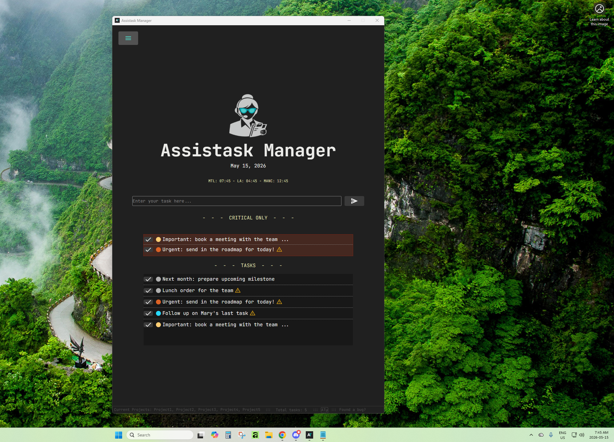
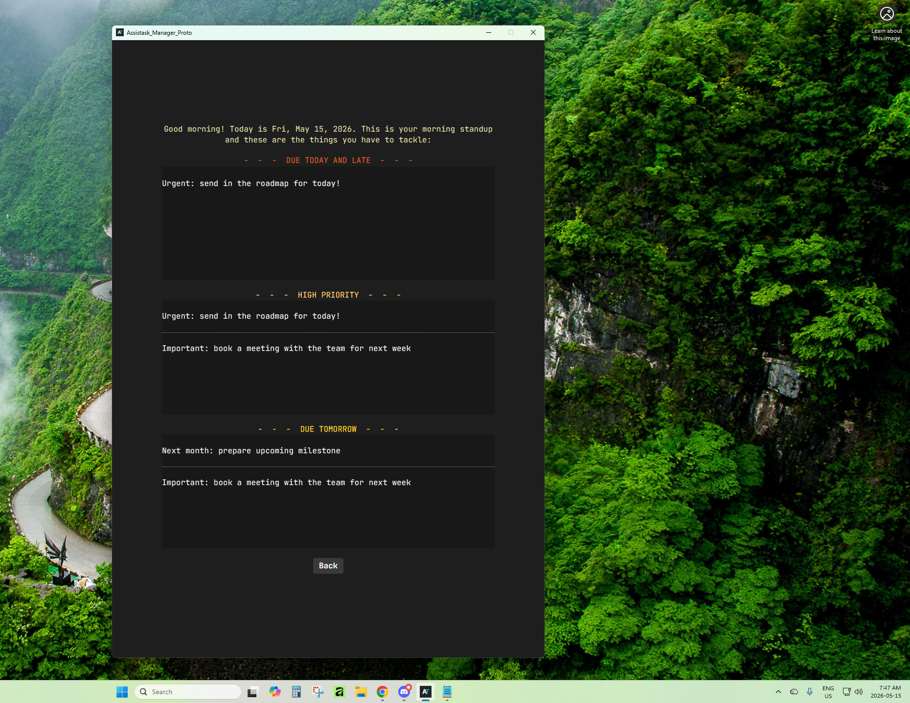
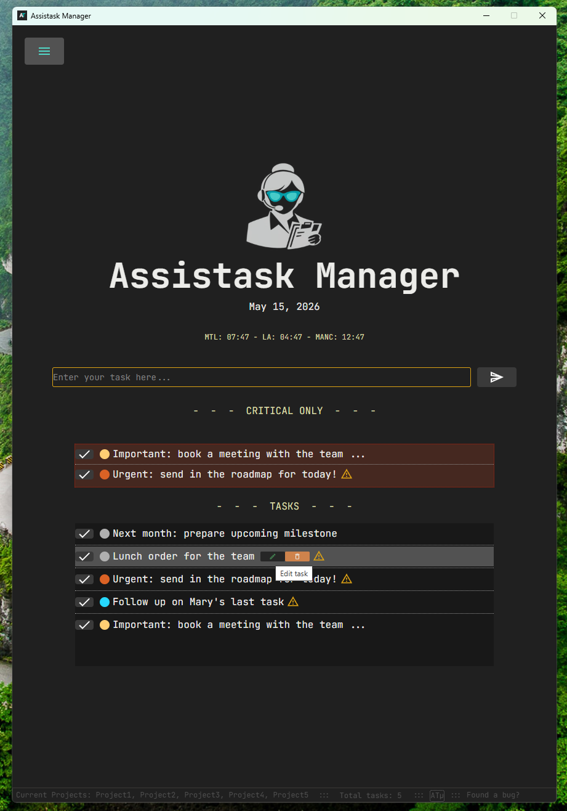
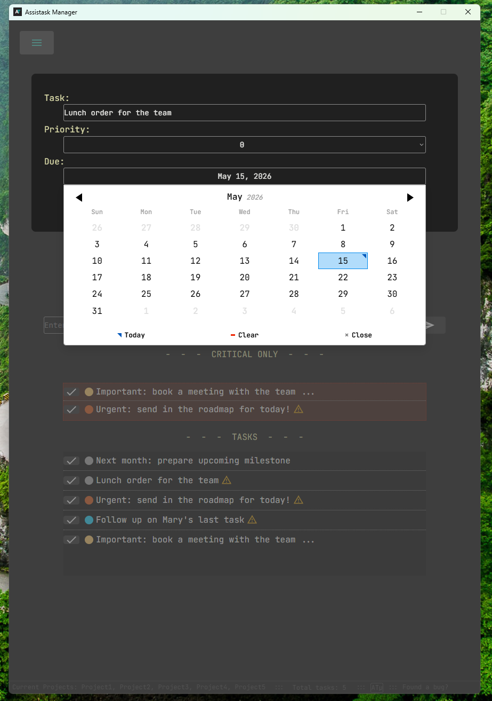
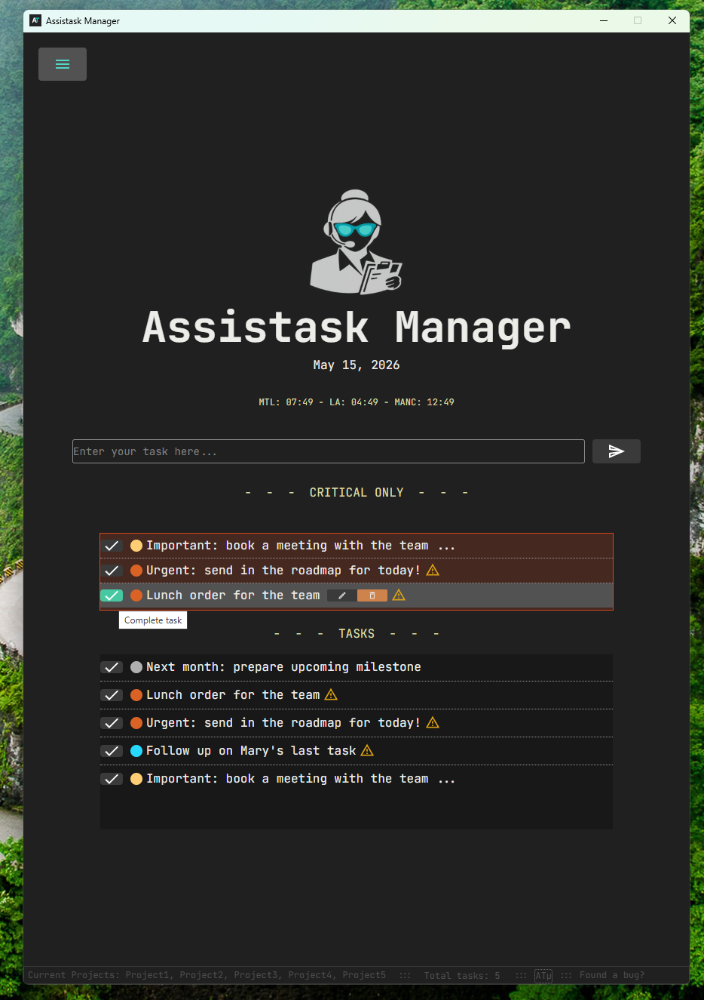
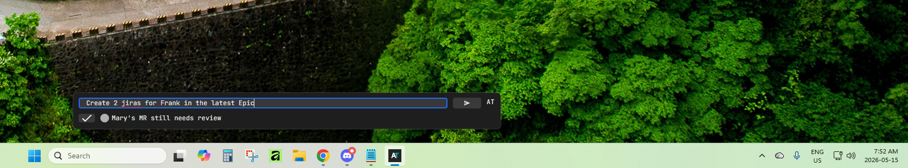

# Assistask Manager (v1.4)

Assistask is a lightweight desktop task manager designed for speed, clarity, and focus.  
It combines a clean Electron desktop app with a Bubble backend to create a frictionless daily workflow.

---

- [Features](#features)
- [Installation](#installation)
- [Usage](#usage)
- [Stack](#stack)
- [Screenshots](#screenshots)

------

---

## Features

- 📝 Fast task creation
- ⚡ Microtask mode for rapid-fire productivity
- 📅 Morning Standup view for daily focus
- 🔄 Real-time sync with Bubble backend
- 🔐 Full authentication flow (signup, login, logout, password reset)
- 🖥️ Native desktop experience via Electron
- 🟢 Tray icon with badge count
- 🎯 Minimal, intentional UI
- 🔔Balloon Notifications

---

## Installation

Download the latest installer from the **Releases** page:

👉 https://github.com/Borrokalari/AssistaskManager/releases/download/v1.4.0/Assistask.Setup.1.4.0.exe

Run the installer and launch Assistask from your desktop or Start menu.

---

## Usage

- Create tasks directly from the main window
- Assistask has a limited word parser and will understand certain works like "important", "critical" and "today"
- With Assistask's word parser it will automatically set a Priority or a Due Date depending on how you name your task
- Assistask has the time shown for local and 2 extra time zones to customize to your needs
- It also has up to 5 Priorities / Projects shown in the status bar 
- Use **Microtask mode** for quick, focused task execution  
- Tasks sync automatically with the backend  
- Access your account settings from the Settings page  

Assistask is designed to disappear and let you work.

---

## Stack

- **Electron** — desktop shell  
- **Bubble** — backend, database, and authentication  
- **JavaScript / HTML / CSS** — renderer  
- **Node.js** — Electron main process  

## Screenshots

